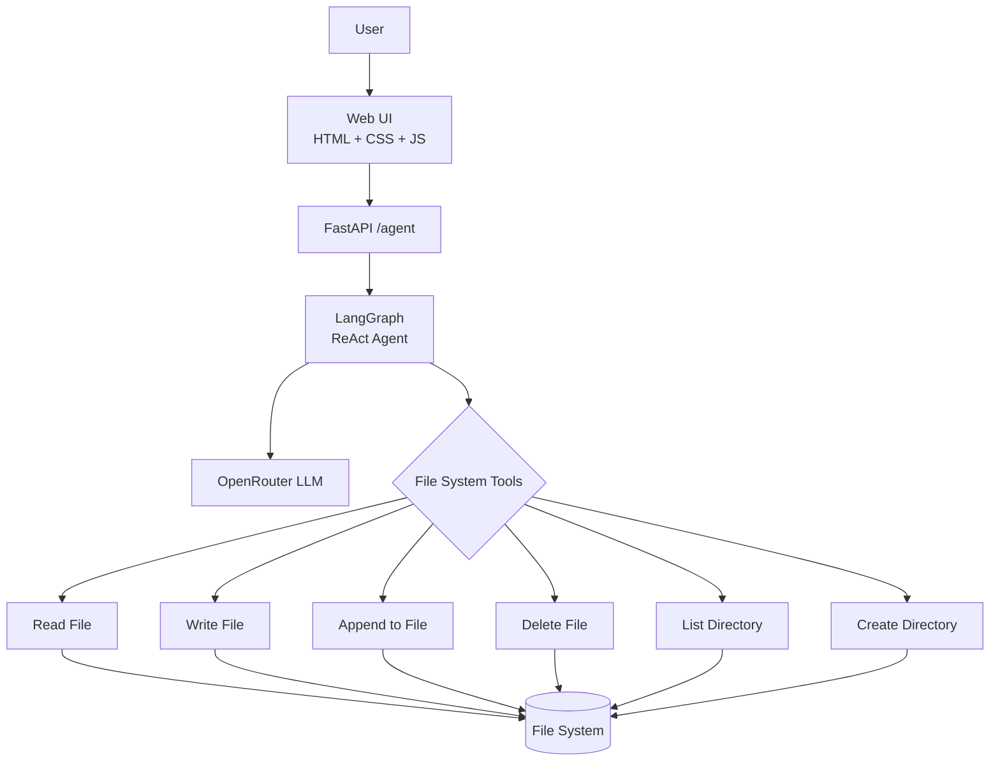

<p align="center">
  
  
  
  
</p>

# File System Agentic AI Agent

An intelligent AI assistant that autonomously interacts with your file system — reading, writing, organizing, and reasoning about files through a conversational web interface.

**Live Demo:** [file-system-agentic-ai-agent.vercel.app](https://file-system-agentic-ai-agent.vercel.app)

## Architecture



## Tech Stack

| Layer | Technology |
|-------|-----------|
| **Backend** | Python FastAPI, Uvicorn |
| **Agent Framework** | LangGraph (create_react_agent) |
| **LLM** | OpenRouter (OpenAI/Anthropic) |
| **Frontend** | Vanilla HTML, CSS, JavaScript |
| **Templating** | Jinja2 |

## API Reference

| Method | Endpoint | Description |
|--------|----------|-------------|
| GET | `/` | Serve the web UI |
| POST | `/agent` | Invoke AI agent with natural language prompt |

### POST /agent

**Request:**
```json
{
  "prompt": "read C:\\Users\\file.txt and summarize it"
}
```

**Response:**
```json
{
  "response": "The file contains..."
}
```

## Agent Tools

| Tool | Description |
|------|-------------|
| `read_file(path)` | Read file contents (handles both Windows `\` and Unix `/` paths) |
| `write_file(path, content)` | Create or overwrite a file |
| `append_to_file(path, content)` | Append content to an existing file |
| `delete_file(path)` | Delete a file |
| `list_directory(path)` | List directory contents |
| `create_directory(path)` | Create a new directory |

## Quick Start

```bash
# Clone
git clone https://github.com/Tochiiy/File_System_Agentic_Ai_Agent.git
cd File_System_Agentic_Ai_Agent

# Install dependencies
pip install -r requirements.txt

# Set up environment
echo "OPENROUTER_API_KEY=your-key-here" > .env
echo "OPENROUTER_BASE_URL=https://openrouter.ai/api/v1" >> .env

# Run
uvicorn main:app --reload --port 8000
```

## Project Structure

```
File_System_Agentic_Ai_Agent/
├── main.py              # FastAPI server
├── Agent.py             # LangGraph ReAct agent + tools
├── requirements.txt     # Python dependencies
├── static/              # Frontend assets
│   ├── index.html       # Web UI shell
│   ├── main.chat.js     # Chat interface logic
│   └── styles.css       # Dark theme styling
└── templates/           # Jinja2 templates
    └── index.html
```

## How It Works

1. User types a natural language command in the terminal-inspired dark UI
2. Request is sent to `/agent` endpoint
3. LangGraph `create_react_agent` receives the prompt with file system tools
4. The LLM (via OpenRouter) decides which tool(s) to call
5. Agent loops through observe-think-act cycles until the task is complete
6. Result is streamed back to the UI

The agent autonomously detects file paths (both Windows and Unix style) and selects the appropriate file operations to fulfill the user's request.
